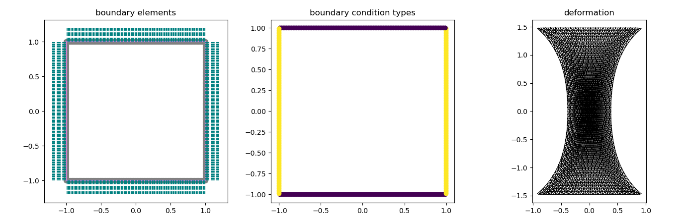

# Navier-Cauchy BEM

This is a minimal example demonstrating how to solve Navier-Cauchy
equation, i.e., linear elasticity, with mixed boundary condition using
BEM. The implementation is based on JAX.

## Linear Elasticity
In **linear elasticity**, the displacement field \( u(x) \in \mathbb{R}^d \) (with \(d = 2,3\)) satisfies:

$$
\nabla \cdot \sigma(u) + f = 0 \quad \text{in } \Omega
$$

where  

- \( \sigma(u) = \lambda (\nabla \cdot u) I + 2 \mu \, \varepsilon(u) \) is the **stress tensor**  
- \( \varepsilon(u) = \frac{1}{2}(\nabla u + \nabla u^T) \) is the **strain tensor**  
- \( \lambda, \mu \) are **Lamé parameters**  
- \( f \) is a body force  

Boundary conditions:  

- **Dirichlet (displacement):** \( u = g \) on \( \Gamma_D \)  
- **Neumann (traction):** \( \sigma(u) n = t \) on \( \Gamma_N \)  

---

## Boundary Integral Formulation
Instead of solving the PDE in the whole domain, **BEM reformulates the problem as an integral equation on the boundary** \( \Gamma = \partial\Omega \).

- Uses **Green’s identities** with the **fundamental solution** (Kelvin solution) of elasticity.  
- Fundamental solution \( U_{ij}(x,y) \): displacement in \(i\)-direction at \(x\) from unit force in \(j\)-direction at \(y\)  
- Traction kernel \( T_{ij}(x,y) \) associated with \( U_{ij} \)  

**Representation formula for a point \(x \in \Omega\):**

\[
u_i(x) = \int_{\Gamma} U_{ij}(x,y) t_j(y)\, d\Gamma(y) - \int_{\Gamma} T_{ij}(x,y) u_j(y)\, d\Gamma(y)
\]

where  

- \( u_j(y) \): boundary displacement  
- \( t_j(y) = \sigma(u)(y) n(y) \): boundary traction  

---

## Boundary Integral Equation (BIE)
Taking the **limit as \(x \to \Gamma\)** yields:

\[
c_{ij}(x) u_j(x) + \int_{\Gamma} T_{ij}(x,y) u_j(y)\, d\Gamma(y)
= \int_{\Gamma} U_{ij}(x,y) t_j(y)\, d\Gamma(y), \quad x \in \Gamma
\]

where \( c_{ij}(x) \) depends on the local geometry (e.g., \( c_{ij} = \frac{1}{2}\delta_{ij} \) at smooth boundary points).  

---

## Discretization